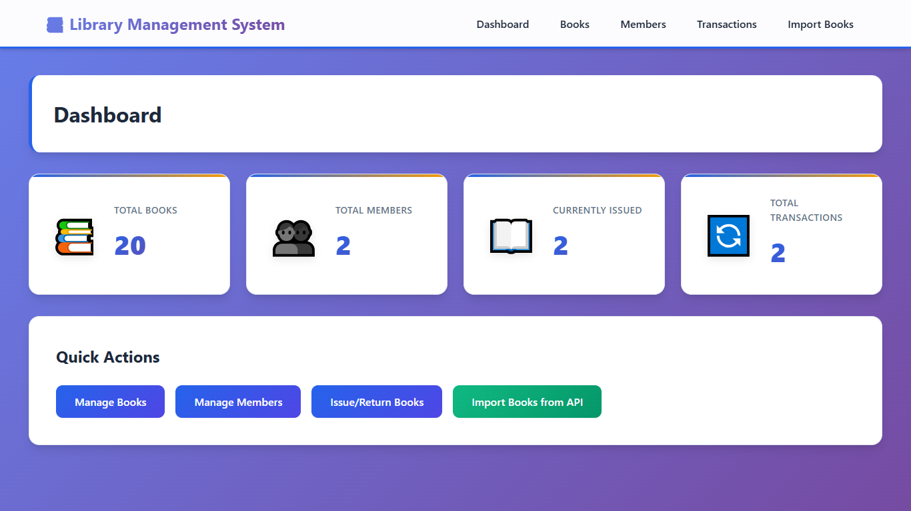
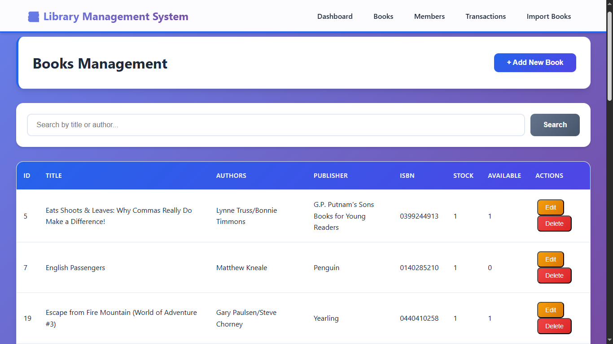
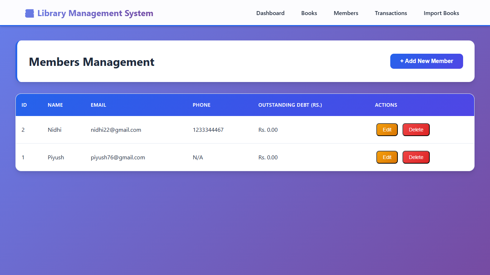
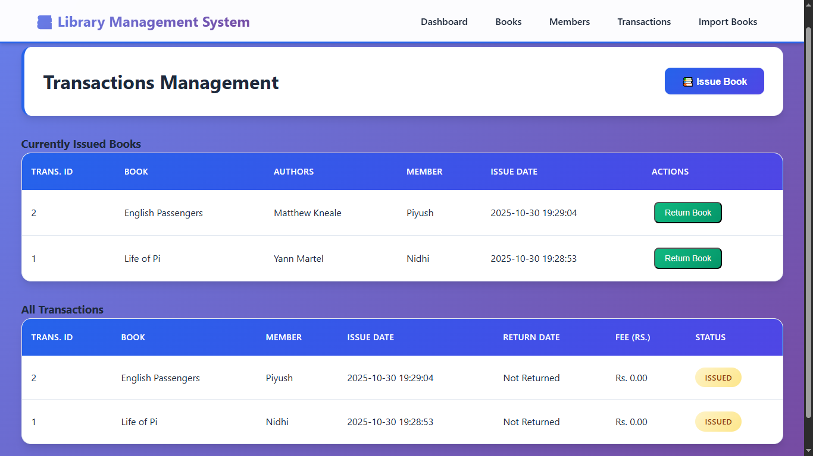

# 📚 Library Management System

A modern, full-featured web application for library management built with **Python(Flask)** and **SQLite**.  
This system enables librarians to efficiently manage books, members, and transactions with an intuitive and responsive interface.

## 🎯 Objectives

- To develop a fully functional **Library Management Web Application** using **Flask** and **SQLite**.  
- To enable librarians to efficiently manage **books, members, and transactions** with CRUD operations.  
- To implement **book issuing and returning** workflows with stock tracking and rent fee calculation.  
- To integrate the **Frappe Library API** for importing books with filtering and pagination support.  
- To ensure clean, reusable, and well-structured code using **Python** for backend.

## 📁 Project Structure

    Library-Management-System/
    │
    ├── 📁 static/
    │ ├── 📁 css/
    │ │ └── style.css # Complete application styling
    │ └── 📁 js/
    │ └── main.js # JavaScript for modals and interactions
    │
    ├── 📁 templates/
    │ ├── base.html # Base template with navigation
    │ ├── index.html # Dashboard with statistics
    │ ├── books.html # Books management interface
    │ ├── members.html # Members management interface
    │ ├── transactions.html # Issue/return books interface
    │ ├── import_books.html # Frappe API import interface
    │ └── reports.html # Reports and analytics
    │
    ├── app.py # Main Flask application
    ├── database.py # Database operations and queries
    ├── library.db # SQLite database (auto-generated)
    ├── requirements.txt # Python dependencies
    ├── .gitignore # Git ignore rules
    └── README.md # This file

## 🚀 Installation & Setup

### Prerequisites
- Python 3.7 or higher  
- pip (Python package installer)  
- Git (for cloning the repository)
- 

## 🚀 Implementation Steps

### **Step 1: Clone the Repository**
Clone the project repository from GitHub using the following command:
  
    git clone https://github.com/yourusername/library-management-system.git
    cd library-management-system

### **Step 2: Create Virtual Environment**

Create a virtual environment to manage dependencies separately.

### On Windows
    python -m venv venv
    venv\Scripts\activate

### On macOS/Linux
    python3 -m venv venv
    source venv/bin/activate

### **Step 3: Install Dependencies**

Install all required Python packages for the project.

    pip install -r requirements.txt

 ### **Step 4: Initialize Database**

 The SQLite database will be automatically created when you first run the application.
It stores data related to books, users, and issued/returned records.

### **Step 5: Run the Application**

Start the Flask server using:

    python app.py

### **Step 6: Access the Application**

Open your web browser and visit:

    http://127.0.0.1:5000

## ✨ Features

### 🧩 Core Functionality

#### 📖 Books Management
- **Complete CRUD Operations:** Add, view, edit, and delete books  
- **Advanced Search:** Search books by title or author with real-time results  
- **Stock Tracking:** Monitor total stock and available copies separately  
- **Duplicate Prevention:** Automatically updates stock for existing books (by ISBN)  
- **Comprehensive Details:** Store title, authors, publisher, ISBN, ISBN13, and page count  

#### 👥 Members Management
- **Member Records:** Maintain detailed member information (name, email, phone)  
- **Debt Tracking:** Real-time tracking of outstanding rental fees  
- **Email Validation:** Ensures unique email addresses for each member  
- **Easy Updates:** Quick edit and delete functionality with confirmation  

#### 🔄 Transaction Management
- **Book Issuing:** Issue books to members with availability checking  
- **Book Returns:** Process returns with customizable rental fees  
- **Transaction History:** Complete log of all issued and returned books  
- **Status Tracking:** Visual indicators for issued vs returned books  
- **Automated Updates:** Stock and debt automatically updated on transactions  

#### 🌐 Frappe API Integration
- **Bulk Import:** Import books directly from Frappe Library API  
- **Flexible Filtering:** Filter by title, authors, ISBN, or publisher  
- **Custom Quantities:** Specify exact number of books to import (1–200)  
- **Smart Pagination:** Automatically fetches multiple pages to reach desired quantity  
- **Professional UI:** Beautiful loading animations and progress indicators  

## 📸 Screenshots

### 🏠 Dashboard  
An overview of key library metrics including total books, members, and issued records.  

### 📚 Book Management  
Interface for adding, editing, searching, and managing books with real-time stock tracking.  

### 👥 Member Management  
Module to register, update, and monitor library members.  

### 🔄 Transaction Management  
Section for issuing and returning books with automatic updates to stock and member debt.  

   
